import MedicalNote from '~/components/MedicalNote.astro';
import ClinicalPearl from '~/components/ClinicalPearl.astro';

## Bản đồ cơ chế tổng quan — Bài 15

```mermaid
flowchart TD
    subgraph T1["CỐ BIỂU LIỄM HÃN"]
        K1["Ngũ bội tử\n(Tannin 60-70%)"]
        K2["Ngũ vị tử\n(Schisandrin, Gomisin)"]
        K3["Mẫu lệ\n(CaCO₃, CaO)"]
    end
    subgraph T2["CỐ TINH SÁP NIỆU"]
        M1["Sơn thù\n(Morroniside, Loganin)"]
        M2["Kim anh\n(Acid citric, malic, Tannin)"]
        M3["Tang phiêu tiêu\n(Protid, Calci)"]
        M4["Khiếm thực / Liên tu\n(Tannin, Flavonoid)"]
    end
    subgraph T3["SÁP TRƯỜNG CHỈ TẢ"]
        S1["Kha tử\n(Tannin, Acid phenolic)"]
        S2["Nhục đậu khấu\n(Myristicin, Elimicin)"]
        S3["Ô mai\n(Acid malic, citric, tartaric)"]
    end

    K1 -->|"Tannin → Protein coagulation\nNiêm mạc thu lại"| P1["THU LIỄM\n(Mồ hôi, Chảy máu)"]
    K2 -->|"Schisandrin → Catecholamine\nGan bảo vệ"| P2["LIỄM HÃN + BẢO VỆ GAN\nHưng phần TK"]
    K3 -->|"CaO → Astringent + Antacid\nCa²⁺ → An thần"| P3["CỐ SÁP + AN THẦN + CHẾ TOAN"]
    M1 -->|"Morroniside → Nephroprotection\nα-glucosidase ↓"| P4["BẢO VỆ THẬN + HẠ ĐƯỜNG HUYẾT\nCỐ TINH (tác dụng cơ học)"]
    M2 -->|"Acid hữu cơ → pH↓\nTannin → Co cơ vòng tiết niệu"| P5["SÁP NIỆU (Co cơ thắt)"]
    S1 & S4 -->|"Tannin → Co cơ trơn ruột\nGiảm nhu động"| P6["SÁP TRƯỜNG CHỈ TẢ"]
    S2 -->|"Myristicin → Ức chế peristalsis\nAnticholinergic-like"| P6
    S3 -->|"Acid malic → pH thấp\nGiun đũa tê liệt"| P7["SÁP TRƯỜNG + SÁT TRÙNG"]
```



---

## 1. Tannin — cơ chế thu liễm chung toàn nhóm

**Tannin là hoạt chất nền của hầu hết thuốc cố sáp.** Hiểu tannin = hiểu cơ chế cả nhóm.

### Cơ chế protein coagulation

```
TANNIN (Hydrolysable tannin: gallotannin, ellagitannin
        Condensed tannin: proanthocyanidin)
    ↓
Tiếp xúc với protein trên bề mặt niêm mạc / vết thương
    ↓
BƯỚC 1: Tannin liên kết hydrogen + hydrophobic với protein
→ Protein kết tủa (precipitation) → "Thuộc da" bề mặt
    ↓
BƯỚC 2: Lớp protein kết tủa = Màng bảo vệ mỏng
→ Giảm tính thấm của niêm mạc (permeability ↓)
    ↓
ÁP DỤNG VỚI MỒ HÔI:
Tuyến mồ hôi bị "đóng lại" bởi màng protein
→ Bài tiết mồ hôi giảm
→ YHCT: "Liễm hãn"

ÁP DỤNG VỚI RUỘT:
Niêm mạc ruột bị "thu lại"
→ Hấp thu nước từ phân tăng, bài tiết dịch ruột giảm
→ Phân cứng lại
→ YHCT: "Sáp trường chỉ tả"

ÁP DỤNG VỚI VẾT THƯƠNG:
Protein máu kết tủa → Cục máu đông nhanh hơn
→ YHCT: "Chỉ huyết, liễm sang"
```

### Tannin Ngũ bội tử — cao nhất trong dược liệu

**Ngũ bội tử chứa 60-70% tannin** — cao hơn bất kỳ dược liệu nào khác trong YHCT.

```
TỔNG TẢ (Tổ ấu trùng Schlechtendalia chinensis trên Rhus chinensis):
- Ấu trùng sâu tiết dịch kích thích cây Muối
- Cây Muối phản ứng tạo "Gall" (tổ) = Khối bướu chứa đầy gallotannin
- Ấu trùng sống trong gallotannin để bảo vệ khỏi thiên địch
    ↓
GALLOTANNIN của Ngũ bội tử:
→ Gallate ester của glucose (pentagalloyl glucose + polymer)
→ Thủy phân trong GI → Gallic acid tự do
→ Gallic acid: Kháng khuẩn + Chống oxy hóa + Protein coagulation
    ↓
ĐẬM ĐỘ CAO → Cầm máu mạnh, liễm sang hiệu quả nhất nhóm
```

---

## 2. Schisandrin/Gomisin (Ngũ vị tử) — Cơ chế đa hướng

**Ngũ vị tử chứa ~30 lignan dibenzocyclooctadiene,** trong đó quan trọng nhất là:
- **Schisandrin A, B, C** (gọi là α, β, γ-schisandrin)
- **Gomisin A, B, C, D, J, N, R** (còn gọi là wuweizi A-G)

### Cơ chế hưng phần TK trung ương

```
SCHISANDRIN A (Deoxyschisandrin)
    ↓
Ức chế MAO (Monoamine Oxidase) — Enzyme phân hủy catecholamine
    ↓
Norepinephrine + Dopamine ↑ ở synapse não
    ↓
YHCT: "Hưng phần trung khu thần kinh"
→ Tăng cảnh giác, phản xạ
→ Tăng thị giác, thính giác (qua dopaminergic pathways)
    ↓
SO SÁNH: Nhẹ hơn thuốc giống amphetamine nhưng cùng hướng cơ chế
```

### Cơ chế liễm Phế / Hưng phần hô hấp

```
GOMISIN A + SCHISANDRIN B
    ↓
Kích thích receptor trên neuron hô hấp ở brainstem
→ Tần số hô hấp ↑
→ Biên độ thở ↑
    ↓
YHCT: "Hưng phần trung khu hô hấp"
→ Trị ho do Phế hư (cơ hô hấp yếu)
→ Hen suyễn (thở nông, tần số chậm)
    ↓
NHƯNG: "Liễm Phế" trong YHCT là THU LIỄM Phế khí
→ Tannin và acid hữu cơ → Thu liễm niêm mạc PQ
→ Giảm bài tiết dịch → Ho ít đờm hơn
→ Kết hợp 2 cơ chế → "Chỉ khái" hoàn chỉnh
```

### Cơ chế bảo vệ gan (ứng dụng lâm sàng quan trọng)

```
SCHISANDRIN B + GOMISIN N
    ↓
BƯỚC 1: Ức chế CYP2E1 (Cytochrome P450 2E1)
→ Giảm activation của hepatotoxins (acetaminophen, CCl₄)
→ Ít ROS (reactive oxygen species) được tạo ra
    ↓
BƯỚC 2: Tăng GSH (Glutathione) nội bào
→ Scavenge ROS còn lại
→ Giảm lipid peroxidation
    ↓
BƯỚC 3: Ức chế NF-κB → TNF-α ↓, IL-6 ↓
→ Giảm viêm tế bào gan
    ↓
KẾT QUẢ: AST/ALT ↓ (men gan)
YHCT: "Sinh tân — viêm gan men chuyển hóa acid amin không hồi phục"
    ↓
THỰC TẾ LÂM SÀNG: Schisandrin B dạng dẫn xuất được nghiên cứu
làm thuốc bảo vệ gan ở Trung Quốc (Schisandrol B)
```

<ClinicalPearl>

**Ngũ vị tử "sinh tân chỉ khát" và viêm gan:** Điều mà YHCT mô tả là "sinh tân" trong trường hợp viêm gan chính là bảo vệ tế bào gan không bị tổn thương thêm. Khi gan bị viêm, chuyển hóa protein, glycogen, và tân dịch suy giảm → YHCT gọi là "tân dịch hư hao". Ngũ vị tử bảo vệ gan → Gan phục hồi → Tân dịch được sinh lại. Đây là ví dụ đẹp về YHCT mô tả kết quả lâm sàng, còn YHHĐ giải thích cơ chế phân tử.

</ClinicalPearl>

---

## 3. Morroniside/Loganin (Sơn thù) — nephroprotection và hạ đường huyết

**Sơn thù có hoạt chất chủ lực là iridoid glycoside** — morroniside và loganin.

### Cơ chế bảo vệ thận

```
MORRONISIDE (Iridoid glycoside từ Cornus officinalis)
    ↓
BƯỚC 1: Ức chế Nox4 (NADPH oxidase 4) ở ty thể tế bào thận
→ Superoxide (O₂⁻) ↓ → ROS trong tế bào ống thận ↓
    ↓
BƯỚC 2: Tăng SIRT3 (Sirtuin 3 — NAD+-dependent deacetylase)
→ Bảo vệ ty thể tế bào thận khỏi apoptosis
    ↓
BƯỚC 3: NF-κB ↓ → IL-1β ↓, TNF-α ↓
→ Giảm viêm ống thận
    ↓
KẾT QUẢ: Nephroprotection rõ ràng
Tế bào ống thận (tubular cells) sống sót tốt hơn
    ↓
YHCT: "Bổ Thận" = Bảo vệ chức năng thận
LIÊN HỆ LÂM SÀNG: Bệnh thận đái tháo đường, tổn thương thận do độc (cisplatin, contrast)
```

### Cơ chế hạ đường huyết

```
LOGANIN + MORRONISIDE
    ↓
Ức chế α-glucosidase (enzyme thủy phân tinh bột → đường đơn ở ruột non)
→ Đường vào máu chậm hơn sau bữa ăn
    ↓
ĐỒNG THỜI:
Cải thiện insulin signaling:
→ GLUT4 translocate lên màng tế bào cơ ↑
→ Glucose uptake vào cơ ↑
    ↓
YHCT: "Bổ Thận" kiêm "Hạ đường huyết" = Cornus trong Lục vị địa hoàng
= Bài đái tháo đường type 2 tốt nhất trong YHCT cổ điển
```

---

## 4. CaCO₃ / CaO (Mẫu lệ) — Antacid + Astringent + Sedation

### Mẫu lệ sống — An thần qua Ca²⁺

```
MẪU LỆ SỐNG (CaCO₃ chiếm 90%)
    ↓
Trong dịch vị acid (HCl):
CaCO₃ + 2HCl → CaCl₂ + H₂O + CO₂
→ Ion Ca²⁺ được giải phóng
    ↓
Ca²⁺ HẤP THU → Vào máu
    ↓
Ca²⁺ ổn định màng neuron (giảm excitability)
→ Hưng phấn quá mức của neuron giảm
→ YHCT: "Trọng trấn an thần" — dùng vật nặng để trấn áp Can dương
    ↓
YHHĐ: Calcium điều chỉnh ngưỡng kích thích thần kinh
→ Lo lắng, mất ngủ, đánh trống ngực giảm
```

### Mẫu lệ nung — Antacid mạnh hơn + Astringent

```
NUNG Ở NHIỆT ĐỘ CAO (>900°C):
CaCO₃ → CaO + CO₂ (bay ra)
    ↓
MẪU LỆ NUNG = CaO (vôi sống) + CaCO₃ còn lại

CỐ SÁP (Astringent mạnh hơn sống):
CaO + H₂O → Ca(OH)₂ (kiềm mạnh)
→ Protein trên bề mặt bị kết tủa mạnh hơn CaCO₃ đơn thuần
→ Liễm hãn tốt hơn

CHẾ TOAN (Antacid mạnh):
CaO + 2HCl → CaCl₂ + H₂O (nhanh hơn nhiều)
CaCO₃ + 2HCl → CaCl₂ + H₂O + CO₂ (chậm hơn)
→ Trung hòa acid dạ dày nhanh
→ pH dạ dày ↑
→ YHCT: "Chế toan" — trị ợ chua, loét dạ dày
```

---

## 5. Myristicin (Nhục đậu khấu) — ức chế nhu động + nguy cơ độc

**Nhục đậu khấu là nutmeg** — gia vị quen thuộc nhưng có cửa sổ điều trị hẹp.

### Cơ chế sáp trường

```
MYRISTICIN (4-Methoxy-6-(2-propenyl)-1,3-benzodioxole)
— Là thành phần chính tinh dầu Myristica (25-40% tinh dầu)
    ↓
Anticholinergic-like effect:
→ Ức chế muscarinic receptor (M3) ở cơ trơn ruột
→ Acetylcholine không gắn được M3
→ Cơ trơn ruột không co theo kích thích thần kinh đối giao cảm
    ↓
Peristalsis ↓↓ (nhu động giảm)
→ Phân di chuyển chậm
→ Hấp thu nước ↑ → Phân cứng
→ YHCT: "Sáp trường chỉ tả" + "Ôn trung" (ôn = ấm lên vì Anticholinergic)
```

### Ngộ độc Myristicin — tại sao liều nhỏ thôi

```
MYRISTICIN ở LIỀU CAO (>5-10 g nutmeg ~ >0,5 mg/kg myristicin):
    ↓
Chuyển hóa → 3,4-methylenedioxyamphetamine (MMDA)
(Chất chuyển hóa có tính chất giống amphetamine/ecstasy nhẹ)
    ↓
Hallucinogen effect:
→ Ảo giác thị giác, thính giác
→ Euphoria
→ Tachycardia, khô miệng (anticholinergic overdose)
→ Buồn nôn, nôn, đau đầu dữ dội
    ↓
YHCT: "Không dùng nhiệt tà, nhiệt lý"
Thực ra: Không dùng liều cao kéo dài
    ↓
LIỀU ĐIỀU TRỊ (3-6 g/ngày): An toàn → Sáp trường thuần túy
LIỀU ĐỘC (>30 g/ngày kéo dài): Nguy hiểm → Hallucinogen
```

<MedicalNote>

**Nutmeg toxicity trong y học hiện đại:** Có các ca ngộ độc Nhục đậu khấu (nutmeg) được báo cáo khi dùng như "recreational drug" ở liều cao (vài thìa bột nutmeg). Triệu chứng: tachycardia, ảo giác, khô miệng, buồn nôn dữ dội — kéo dài 24-72h. Trong YHCT, liều 3-6 g/ngày an toàn hoàn toàn vì cửa sổ điều trị đủ rộng ở liều đó.

</MedicalNote>

---

## 6. Acid hữu cơ (Ô mai) — cơ chế sát trùng giun đũa

### pH và hành vi giun đũa

```
GIUN ĐŨA (*Ascaris lumbricoides*):
- Sống ở pH 7.5-8.0 (ruột non người)
- Hô hấp kỵ khí (anaerobic) → Sản xuất ATP từ glycolysis
- Bám vào niêm mạc ruột qua protein adhesin
    ↓
ÔI MAI đến ruột non:
ACID MALIC + ACID CITRIC + ACID TARTARIC
→ pH ruột non ↓ từ 7.5 xuống 5-6 (acid hóa cục bộ)
    ↓
BƯỚC 1: Enzyme bám dính của giun bất hoạt ở pH thấp
→ Giun không còn bám được niêm mạc
    ↓
BƯỚC 2: Phosphofructokinase (PFK) — enzyme key của glycolysis giun
→ Bất hoạt ở pH thấp (hoạt tính tối ưu ở pH 7-8)
→ ATP của giun ↓↓ → Giun yếu dần
    ↓
BƯỚC 3: Cơ thành cơ thể giun co thắt không kiểm soát (spasm)
→ Giun co cụm, bất động
    ↓
BƯỚC 4: Giun không bám, không di chuyển, yếu
→ Nhu động ruột tống giun ra ngoài
→ YHCT: "Sát trùng"
```

---

## 7. Worked example — Đạo hãn sau sốt kéo dài

**Bệnh nhân:** Nữ 45 tuổi, vừa khỏi viêm phổi sau 2 tuần kháng sinh. Hết sốt 1 tuần. Hiện tại: Mồ hôi trộm mỗi đêm, ngủ ra mồ hôi nhiều, thức dậy áo đẫm mồ hôi, khô miệng, lưỡi đỏ ít rêu, mạch tế sác. YHCT: Âm hư nội nhiệt — Đạo hãn.

**Phân tích:** Sốt kéo dài → Tân dịch và âm hư hao → Âm hư hỏa vượng → Đêm nằm, vệ khí đi vào trong (tự nhiên ban đêm), hỏa bức đẩy mồ hôi ra → Đạo hãn.

**Bài thuốc:**

| Vị thuốc | Vai trò | Cơ chế YHHĐ |
|---|---|---|
| Ngũ vị tử 6 g | Liễm hãn + Sinh tân | Tannin/acid → Thu liễm tuyến mồ hôi; Schisandrin → Gan phục hồi tân dịch |
| Mẫu lệ nung 20 g | Liễm hãn + An thần | CaO protein coagulation tuyến mồ hôi; Ca²⁺ an thần |
| Long cốt nung 20 g | Trọng trấn an thần + Liễm hãn | Ca²⁺ + tannin → Thu liễm |
| Hoàng kỳ 15 g | Bổ vệ khí + Cố biểu | Polysaccharide → Tăng IgA niêm mạc, ổn định vệ khí |
| Đương quy 9 g | Dưỡng huyết | Ferulic acid → Tăng tuần hoàn vi mạch, phục hồi âm huyết |
| Sinh địa 12 g | Dưỡng âm thanh nhiệt | Catalpol → Hạ nhiệt; Nourish âm dịch |

**Chuỗi cơ chế:**

```
Ngũ vị tử + Mẫu lệ + Long cốt
    ↓
Tuyến mồ hôi: Tannin + CaO + Ca²⁺
→ Protein kết tủa trên tế bào biểu mô tuyến mồ hôi
→ Tính thấm giảm → Mồ hôi bài tiết ít hơn (NGẮN HẠN)
    ↓
Hoàng kỳ + Ngũ vị tử
→ Vệ khí (immune function) phục hồi → Cố biểu (DÀI HẠN)
    ↓
Đương quy + Sinh địa
→ Âm huyết bù đắp → Nội nhiệt giảm → Hỏa không bức mồ hôi ra nữa (GỐC RỄ)
    ↓
TỔNG HỢP: Điều trị từ 3 tầng:
Tầng 1 (Triệu): Liễm hãn → Cầm mồ hôi ngay
Tầng 2 (Cơ): Cố biểu → Vệ khí mạnh
Tầng 3 (Bản): Dưỡng âm → Không còn âm hư hỏa vượng
```

---

## 8. Cầu nối YHCT → YHHĐ — Bài 15 tóm tắt

| Khái niệm YHCT | Cơ chế YHHĐ | Hoạt chất chủ lực |
|---|---|---|
| Thu liễm cố sáp (chung) | Tannin → Protein coagulation → Giảm tính thấm niêm mạc | Gallotannin, condensed tannin |
| Ngũ bội tử liễm sang chỉ huyết | Gallic acid nồng độ cao → Cầm máu tốt nhất nhóm | Gallotannin 60-70% |
| Ngũ vị tử liễm hãn | Tannin + acid hữu cơ → Thu liễm tuyến mồ hôi | Acid hữu cơ (malic, citric) |
| Ngũ vị tử sinh tân bảo vệ gan | Schisandrin B ức chế CYP2E1, ↑GSH, ↓NF-κB | Schisandrin A/B, Gomisin A/N |
| Ngũ vị tử hưng phần TK | Ức chế MAO → Catecholamine ↑ synapse | Schisandrin A (deoxyschisandrin) |
| Mẫu lệ sống nhuyễn kiên an thần | Ca²⁺ ổn định màng neuron → Giảm hưng phấn | CaCO₃ → Ca²⁺ |
| Mẫu lệ nung cố sáp chế toan | CaO → Astringent mạnh + Antacid HCl nhanh | CaO (sau nung) |
| Sơn thù bổ Thận | Morroniside → Nox4↓, SIRT3↑, NF-κB↓ → Nephroprotection | Morroniside, Loganin |
| Sơn thù hạ đường huyết | α-glucosidase ↓ + GLUT4 ↑ | Loganin, Morroniside |
| Kha tử/Ngũ bội tử sáp trường | Tannin → Co niêm mạc ruột + Ức chế tiết dịch ruột | Tannin + acid phenolic |
| Nhục đậu khấu ôn trung sáp trường | Myristicin → Anticholinergic → Peristalsis ↓ | Myristicin (tinh dầu) |
| Ô mai sát trùng giun đũa | Acid malic/citric → pH ↓ → PFK bất hoạt → Giun liệt | Acid malic, citric, tartaric |
| Kim anh cố tinh sáp niệu | Tannin → Co cơ vòng tiết niệu; Acid citric → pH thấp ↓ vi khuẩn | Tannin + Acid citric/malic |
