import MedicalNote from '~/components/MedicalNote.astro';
import ClinicalPearl from '~/components/ClinicalPearl.astro';

## Bản đồ cơ chế tổng quan — Bài 16

```mermaid
flowchart TD
    subgraph G1["BỔ KHÍ"]
        K1["Nhân sâm\n(Ginsenosid Rg1, Rb1)"]
        K2["Hoàng kỳ\n(Astragalosid IV)"]
        K3["Cam thảo bắc\n(Glycyrrhizin)"]
        K4["Đảng sâm\n(Codonopsinol, Polysaccharid)"]
    end
    subgraph G2["BỔ DƯƠNG"]
        D1["Dâm dương hoắc\n(Icariin)"]
        D2["Đỗ trọng\n(Pinoresinol-diglucosid)"]
        D3["Ba kích · Phá cốt chi · Nhục thung dung\n(Polysaccharid, Iridoid, Lignan)"]
    end
    subgraph G3["BỔ HUYẾT"]
        H1["Thục địa\n(Iridoid glycosid)"]
        H2["Bạch thược\n(Paeoniflorin)"]
        H3["Hà thủ ô chế\n(Stilben, ít antraglycosid)"]
        H4["A giao\n(Collagen, Acid amin)"]
    end
    subgraph G4["BỔ ÂM"]
        A1["Sa sâm · Ngọc trúc · Bách hợp\n(Polysaccharid, Saponin steroid)"]
        A2["Câu kỷ tử\n(Zeaxanthin, Polysaccharid)"]
    end

    K1 -->|"HPA axis → Cortisol cân bằng\nNK cell ↑ · IgM ↑"| P1["ADAPTOGEN\nChống stress · Tăng miễn dịch"]
    K2 -->|"NK cell ↑ · Interferon-γ ↑\nLợi tiểu nhẹ"| P1
    K3 -->|"Mineralocorticoid-like\n→ Na⁺ giữ · K⁺ thải\n→ Phù nề nếu dùng lâu"| P2["CORTICOID-LIKE\nChống viêm · Giữ Na⁺"]
    K4 -->|"Polysaccharid → Macrophage ↑\nThần kinh → Cholinergic ↑"| P1

    D1 -->|"PDE5 inhibition → cGMP ↑\nOPG/RANKL → Tạo xương ↑\nHPG axis → Testosterone ↑"| P3["TRÁNG DƯƠNG\nSinh dục · Xương · Kháng viêm"]
    D2 -->|"ACE inhibition\nGiãn mạch trơn tử cung"| P4["HẠ ÁP · AN THAI\nChống loãng xương"]
    D3 -->|"Estrogen-like (Nhục thung dung, Phá cốt chi)\nPolysaccharid kích thích sinh sản"| P3

    H1 -->|"Iridoid → Erythropoietin-like\n→ Tăng sinh hồng cầu"| P5["TẠO HUYẾT\nBổ huyết · Nội tiết"]
    H2 -->|"Paeoniflorin → COX-2 ↓\nỨc chế TK TW\nGiảm co thắt cơ trơn"| P6["THƯ CÂN · GIẢM ĐAU\nBình Can · Liễm âm"]
    H3 -->|"Stilben (resveratrol-like)\n→ Bảo vệ gan · Chống oxy hóa"| P5
    H4 -->|"Collagen type I, II\nAcid amin tạo máu"| P5

    A1 -->|"Polysaccharid bảo vệ niêm mạc\nSaponin steroid → điều hòa miễn dịch"| P7["DƯỠNG ÂM\nBảo vệ niêm mạc · Sinh tân"]
    A2 -->|"Zeaxanthin → bảo vệ võng mạc\nPolysaccharid → hạ đường huyết"| P7
```



---

## 1. Nhân sâm — Ginsenosid và cơ chế Adaptogen

**Nhân sâm là thuốc adaptogen kinh điển nhất thế giới.** Cơ chế không phải kích thích đơn thuần mà là **điều hòa cân bằng hai chiều**.

### 1.1. Cơ chế HPA axis

```
STRESS (vật lý / tâm lý / nhiễm trùng)
    ↓
Hypothalamus → CRH (Corticotropin-releasing hormone)
    ↓
Pituitary → ACTH
    ↓
Adrenal cortex → Cortisol

BẤT THƯỜNG trong stress kéo dài:
→ Cortisol tăng quá mức → ức chế miễn dịch, teo cơ, đường huyết cao

GINSENOSID tác dụng:
→ Rg1: Điều hòa (modulate) receptor glucocorticoid → cortisol không quá cao
→ Rb1: Ức chế apoptosis neuron → bảo vệ não trước stress
→ Cả hai: Điều hòa HPA → cortisol nằm trong khoảng bình thường hơn
```

### 1.2. Cơ chế miễn dịch

- Ginsenosid tăng NK (Natural Killer) cell activity → diệt tế bào ung thư, virus.
- Tăng IgM và bổ thể (complement) → kháng nhiễm trùng tốt hơn.
- Tăng tiết interferon-γ → kháng virus.

### 1.3. Tại sao "Đại bổ nguyên khí" lại phù hợp trong cấp cứu?

YHCT "nguyên khí thoát" (khí thoát, khí nghịch) tương đương YHHĐ với **shock** (sốc tim, sốc nhiễm khuẩn, sốc mất máu). Ginsenosid tác dụng:
- Tăng sức co bóp cơ tim (inotropic effect nhẹ).
- Co mạch ngoại vi → duy trì huyết áp.
- Cải thiện vi tuần hoàn → chống thiếu oxy mô.

---

## 2. Hoàng kỳ — Astragalosid IV và Immunomodulation

Astragalosid IV (Cycloastragenol glycoside) là hoạt chất quan trọng nhất của Hoàng kỳ:

```
ASTRAGALOSID IV
    ↓
1. Kích hoạt Telomerase (enzyme dài hóa telomere)
   → Tế bào miễn dịch không "già hóa" nhanh
   → NK cell, T lymphocyte duy trì được hoạt tính
    ↓
2. Tăng hoạt tính NK cell và macrophage
   → Tiêu diệt vi khuẩn, virus, tế bào ung thư
    ↓
3. Tăng interferon-γ
   → Kháng virus (đặc biệt herpesvirus)
    ↓
4. Điều hòa Th1/Th2 balance
   → Không gây dị ứng như một số chất kích thích miễn dịch khác
```

**"Cố biểu" YHCT = immunomodulation của Vệ khí (innate immunity).**

---

## 3. Cam thảo bắc — Glycyrrhizin và bẫy Corticoid-like

Glycyrrhizin là saponin triterpen — được thủy phân thành **Glycyrrhetic acid (GA)**.

```
GLYCYRRHETIC ACID (GA)
    ↓
Ức chế 11β-HSD2
(11-beta-hydroxysteroid dehydrogenase type 2)
    ↓
11β-HSD2 bình thường: biến cortisol → cortisone (không hoạt động)
    ↓ KHI BỊ ỨC CHẾ:
Cortisol tích lũy tại thận, mạch máu
    ↓
Gắn vào Mineralocorticoid receptor (không chọn lọc)
    ↓
→ Giữ Na⁺, thải K⁺ → Phù nề, tăng huyết áp
→ (Tác dụng giống Aldosterone / Corticoid)
```

**Đây là cơ sở khoa học giải thích:** "Dùng Cam thảo lâu sẽ bị phù nề" trong nguyên văn sách.

<ClinicalPearl>

**Pseudo-hyperaldosteronism do Cam thảo:**

Dùng Cam thảo > 150g/tháng (~5g/ngày) kéo dài → Na⁺ giữ, K⁺ hạ, huyết áp cao, phù nề. Còn gặp trong kẹo cam thảo (liquorice candy) ở Âu Mỹ. Ngừng thuốc → tự phục hồi trong 2-4 tuần. Khi cần dùng lâu → giảm liều + theo dõi điện giải.

</ClinicalPearl>

---

## 4. Dâm dương hoắc — Icariin: Phân tích 3 tác dụng

Icariin là flavonoid glycoside đặc trưng của Dâm dương hoắc. **3 cơ chế chính:**

### 4.1. Tráng dương — PDE5 inhibition

```
ICARIIN
    ↓
Ức chế PDE5 (Phosphodiesterase type 5)
(tương tự sildenafil/tadalafil nhưng yếu hơn)
    ↓
PDE5 bình thường phân hủy cGMP → khi bị ức chế:
cGMP tăng tích lũy
    ↓
Protein kinase G (PKG) kích hoạt
    ↓
Ca²⁺ giảm trong tế bào cơ trơn
    ↓
Giãn cơ trơn mạch máu thể hang (corpus cavernosum)
    ↓
Tăng lưu lượng máu → Cương dương
```

### 4.2. Mạnh gân cốt — Osteogenesis

```
ICARIIN
    ↓
Kích thích BMP-2 (Bone Morphogenetic Protein 2)
    ↓
Osteoblast differentiation ↑ (tăng biệt hóa tạo cốt bào)
    ↓
Đồng thời: Giảm RANKL/OPG ratio
    ↓
→ Ức chế hủy cốt bào (osteoclast)
    ↓
Net effect: Tăng mật độ xương, chống loãng xương
```

### 4.3. Trừ phong thấp — Kháng viêm khớp

```
ICARIIN
    ↓
Ức chế NF-κB pathway
    ↓
→ Giảm IL-1β, IL-6, TNF-α
→ Giảm COX-2 → Giảm prostaglandin
    ↓
Giảm viêm màng hoạt dịch
Giảm đau khớp, sưng khớp
```

---

## 5. Đỗ trọng — Pinoresinol và hạ huyết áp

**Tại sao sao thì hạ áp tốt hơn?**

```
PINORESINOL-DIGLUCOSID (Đỗ trọng sống)
    ↓
Thủy phân chậm → Pinoresinol
    ↓
Ức chế ACE (Angiotensin-Converting Enzyme) vừa phải
    ↓
Giảm Angiotensin II → Giảm co mạch → Hạ áp nhẹ

KHI SÀO (nhiệt phân):
    ↓
Pinoresinol-diglucosid phân hủy nhanh hơn → giải phóng nhiều Pinoresinol hơn
+ Tổng hợp thêm các phenolic acid (acid chlorogenic, caffeic acid)
→ Cộng hợp tác dụng ACE inhibition mạnh hơn
→ HẠ ÁP MẠNH HƠN KHI ĐUN SÔI SẮC
```

**Ngoài ra:** Aucubin (iridoid) trong Đỗ trọng → giãn cơ trơn tử cung → an thai (giảm co thắt tử cung sớm).

---

## 6. Bạch thược — Paeoniflorin: Thư cân và Bình Can

```
PAEONIFLORIN (Monoterpen glycosid)
    ↓
    ├── Ức chế COX-1, COX-2 → Giảm PGE2
    │   → Giảm đau · Giảm viêm · Hạ sốt
    │
    ├── Điều hòa thần kinh trung ương
    │   → Ức chế NMDA receptor (ở liều cao)
    │   → Trấn tĩnh · Chống co giật
    │
    ├── Giảm acetylcholine tại cơ trơn
    │   → Giảm co thắt cơ trơn ruột, tử cung
    │   → "Thư cân" YHCT
    │
    └── Giảm tiết acid dạ dày
        → Bảo vệ niêm mạc dạ dày
```

**Bài thuốc kinh điển:** *Thược dược cam thảo thang* (Bạch thược + Cam thảo) = Paeoniflorin (thư cơ) + Glycyrrhizin (chống viêm) → giảm đau bụng do co thắt, chuột rút cơ bắp. Cơ chế rõ ràng và đã được nghiên cứu hiện đại xác nhận.

---

## 7. Hà thủ ô đỏ — Tại sao chế = loại antraglycosid?

```
HÀ THỦ Ô SỐNG
Antraglycosid: Emodin, Physcion (10-15%)
    ↓
Thủy phân tại ruột già → Anthraquinone tự do
    ↓
Kích thích cơ trơn ruột già (pro-kinetic)
→ Tăng nhu động → Nhuận tràng / Tiêu chảy
    ↓
Emodin liều cao kéo dài → Độc gan (hepatotoxicity)
(Cơ chế: ức chế mitochondrial electron transport chain)

CHẾ BIẾN NỮA ĐẬU ĐEN (9 lần):
    ↓
1. Nhiệt độ cao + thời gian → Antraglycosid phân hủy (80-90%)
2. Saponin đậu đen liên kết với emodin → tạo phức kết tủa
3. pH từ nước đậu đen → thủy phân emodin thành dạng bất hoạt

KẾT QUẢ: Hà thủ ô chế
    ↓
Còn lại: Stilben (resveratrol-like) · Flavonoid · Tannin
    → Bảo vệ gan · Chống oxy hóa · Chống lão hóa
    → Ngăn rụng tóc (ức chế DHT — dihydrotestosterone)
    → Bổ Can Thận an toàn dài hạn
```

---

## 8. Thục địa — Iridoid Rhemanin và hematopoiesis

```
IRIDOID GLYCOSID (Rhemanin, Catalpol)
    ↓
Kích thích tủy xương:
→ Tăng erythropoiesis (sinh hồng cầu)
→ Tăng thrombopoiesis (sinh tiểu cầu)
→ Điều hòa miễn dịch dịch thể

CỤ THỂ:
Catalpol → Tăng GM-CSF (granulocyte-macrophage colony-stimulating factor)
          → Kích thích tế bào gốc tủy xương
          → Hồng cầu tăng → Hemoglobin tăng

Rhemanin → Ức chế sự hao hụt Calcium từ xương
           → Bảo vệ xương (tương hỗ với bổ dưỡng chung)
```

**Lý giải YHCT → YHHĐ:** "Tư âm bổ huyết" của Thục địa = kích thích tủy xương sinh hồng cầu + bảo vệ niêm mạc (tân dịch) qua polysaccharid.

---

## 9. Bổ âm — Polysaccharid và cơ chế dưỡng niêm mạc

Sa sâm, Ngọc trúc, Bách hợp, Mạch môn đều giàu **polysaccharid** và **saponin steroid**:

```
POLYSACCHARID (từ Ngọc trúc, Sa sâm, Bách hợp)
    ↓
Bao phủ niêm mạc (mucoprotective effect):
→ Tạo lớp gel bảo vệ niêm mạc dạ dày, phế quản
→ Giảm khô miệng, giảm ho khan (cơ chế cơ học)

SAPONIN STEROID (Bách hợp, Ngọc trúc)
    ↓
Điều hòa miễn dịch tại niêm mạc (mucosal immunity)
→ Tăng IgA tiết
→ Bảo vệ đường hô hấp trên và dưới

TẠI SAO PHẢI PHỐI LÝ KHÍ KHI DÙNG VỚI TỲ HƯ?
Polysaccharid + saponin nhầy nhớt → tăng độ nhớt dịch tiêu hóa
→ Enzyme tiêu hóa bị "pha loãng" / bị ức chế
→ Tỳ Vị hư sẵn → tiêu hóa càng kém
→ Phối Trần bì (Hesperidin → kích thích tiết dịch vị, tăng nhu động) → giải quyết nê trệ
```

---

## 10. Worked example — Huyết hư sau sinh

**Tình huống:** Phụ nữ 30 tuổi, 2 tháng sau sinh thường, mất nhiều máu khi sinh. Hiện: da xanh, hồi hộp, mất ngủ, ra mồ hôi trộm ban đêm, kinh nguyệt chưa phục hồi.

**Phân tích YHCT:**
- Da xanh, mệt mỏi → Huyết hư.
- Hồi hộp, mất ngủ → Tâm huyết hư (Tâm không được nuôi dưỡng).
- Mồ hôi trộm ban đêm → Âm hư (hư nhiệt bức mồ hôi ra).
- Kinh nguyệt chưa phục hồi → Can huyết hư (Huyết hải không đủ).

**Suy ra chuỗi cơ chế YHHĐ:**
```
Mất máu lớn khi sinh
    ↓
Hồng cầu, Hb giảm → Thiếu máu (huyết hư)
    ↓
Oxy não giảm → Mất ngủ, kém tập trung (Tâm huyết hư)
Oxy cơ trơn mạch giảm → Tim đập bù nhanh → Hồi hộp
    ↓
Kích thích giao cảm bù → Mồ hôi ban đêm (âm hư)
Hormone sinh dục chưa phục hồi → Kinh nguyệt chưa trở lại
```

**Phối thuốc:**
- **Thục địa** (iridoid → tăng erythropoiesis, sinh hồng cầu).
- **A giao** (collagen, acid amin → nguyên liệu tạo huyết + cầm huyết).
- **Bạch thược** (paeoniflorin → thư cân, an thần nhẹ, điều hòa kinh nguyệt).
- **Đương quy** (ferulic acid → hoạt huyết, điều kinh, bổ huyết).
- **Đảng sâm + Bạch truật** (bổ khí để "khí sinh huyết").
- **Táo nhân** (dưỡng Tâm an thần → mất ngủ).

→ Tương đương bài **Bát trân thang gia giảm** + an thần.

<MedicalNote>

**Lý luận YHCT "Khí sinh huyết":**

YHCT nói "Khí là soái của huyết — Huyết là mẹ của khí." Thực ra phối Đảng sâm (bổ khí) với Thục địa (bổ huyết) có cơ sở YHHĐ: Đảng sâm tăng EPO (erythropoietin) + cải thiện tuần hoàn vi mạch tủy xương → tế bào gốc tủy xương được nuôi dưỡng tốt hơn → sinh hồng cầu hiệu quả hơn khi có đủ nguyên liệu từ Thục địa.

</MedicalNote>
