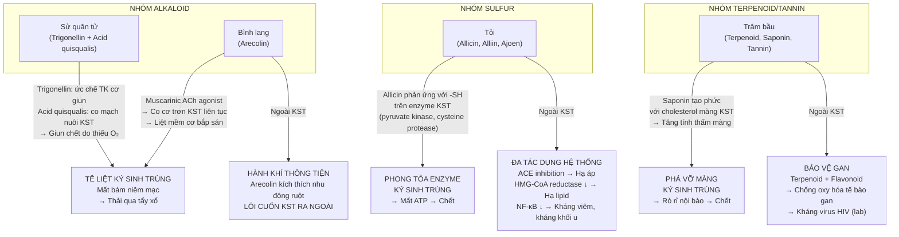
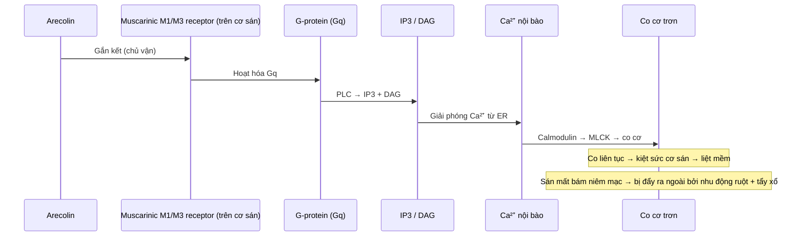
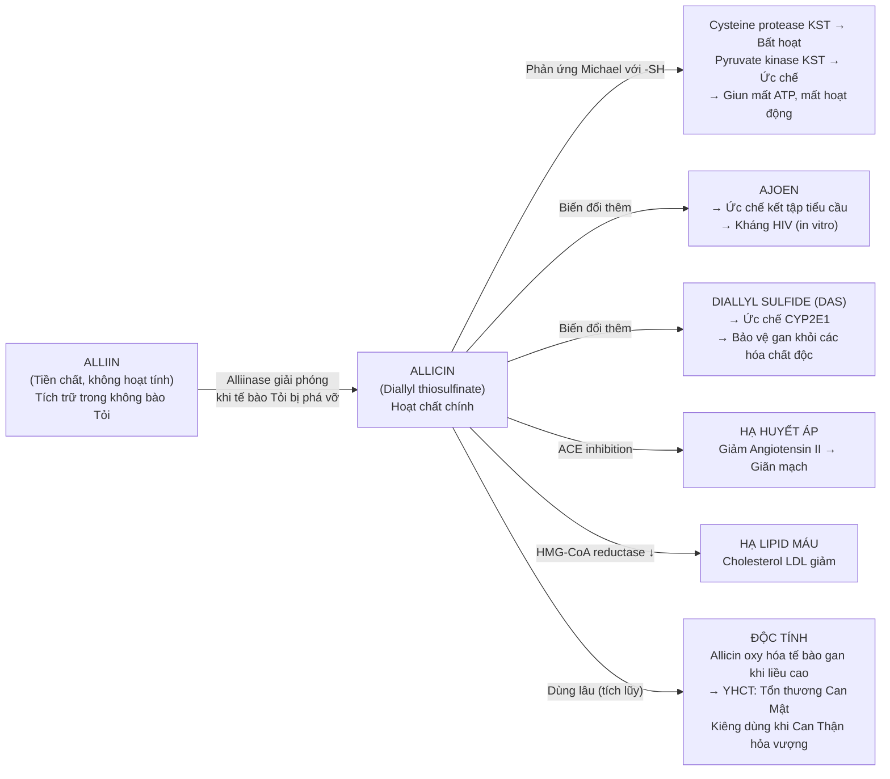
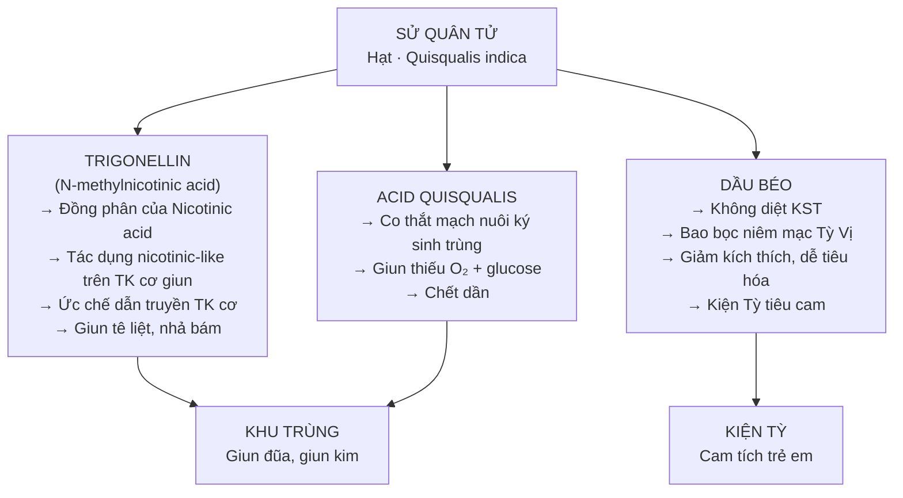
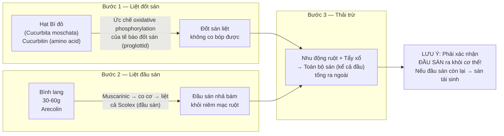

import MedicalNote from '~/components/MedicalNote.astro';
import ClinicalPearl from '~/components/ClinicalPearl.astro';

## Bản đồ cơ chế tổng quan — Bài 17

---

## Cơ chế chi tiết — Bình lang (Arecolin)

**Tại sao sán sơ mít cần liều cao hơn?**
Sán sơ mít (*Taenia solium*): Scolex (đầu sán) có 4 giác hút + 2 vòng móc bám sâu vào nhung mao. Cần nồng độ arecolin cao và kéo dài hơn để làm liệt toàn bộ bộ máy bám. Sán dây (*Taenia saginata*): Không có móc, chỉ có giác hút → liệt dễ hơn với liều thấp.

---

## Cơ chế chi tiết — Tỏi (Allicin)

<MedicalNote>

**Tại sao Tỏi phải dùng tươi (hoặc mới giã)?**

Alliin → Allicin chỉ xảy ra khi enzyme alliinase tiếp xúc với cơ chất (khi Tỏi bị nghiền/giã/cắt). Tỏi đun nấu kỹ: alliinase bị biến tính nhiệt → allicin không tạo thành → mất tác dụng kháng khuẩn và trừ giun. Giải pháp: Giã tỏi trước 10 phút, để phản ứng hoàn tất, sau đó mới đun nếu cần — allicin đã hình thành sẽ bền nhiệt hơn.

</MedicalNote>

---

## Cơ chế chi tiết — Sử quân tử

---

## Worked example — Sán sơ mít: Phối Bình lang + Hạt Bí đỏ

<ClinicalPearl>

**Tại sao phải xác nhận đầu sán ra ngoài?**

Sán dây và sán sơ mít tái sinh từ đầu sán (scolex). Nếu thân sán (proglottid) thải ra nhưng scolex còn gắn trong ruột → trong vài tuần, sán mọc lại hoàn toàn. Điều trị thành công = **phải thấy đầu sán trong phân** (kiểm tra kính hiển vi). Đây là lý do Bình lang liều cao (30–60 g) bắt buộc với sán sơ mít — đủ nồng độ để liệt cả scolex vốn bám rất chắc.

</ClinicalPearl>

---

## Bảng cơ chế so sánh — góc nhìn dược lý YHHĐ

<table>
<thead>
<tr><th>Vị thuốc</th><th>Hoạt chất</th><th>Đích phân tử</th><th>Hậu quả với KST</th><th>Công năng YHCT tương ứng</th></tr>
</thead>
<tbody>
<tr><td>Bình lang</td><td>Arecolin</td><td>Muscarinic M1/M3 receptor cơ sán</td><td>Co cơ → liệt mềm → mất bám</td><td>Sát trùng, hành khí (thông tiện đẩy KST)</td></tr>
<tr><td>Sử quân tử</td><td>Trigonellin</td><td>Nicotinic-like receptor TK cơ giun</td><td>Ức chế dẫn truyền → liệt giun</td><td>Khu trùng tiêu tích</td></tr>
<tr><td>Sử quân tử</td><td>Acid quisqualis</td><td>Mạch máu nuôi KST</td><td>Co mạch → giun thiếu O₂ → chết</td><td>Khu trùng tiêu tích</td></tr>
<tr><td>Tỏi</td><td>Allicin</td><td>Nhóm -SH enzyme KST (pyruvate kinase, cysteine protease)</td><td>Bất hoạt enzyme → mất ATP → chết</td><td>Sát trùng, giải độc</td></tr>
<tr><td>Trâm bầu</td><td>Saponin, Terpenoid</td><td>Cholesterol màng tế bào KST</td><td>Tăng tính thấm màng → rò rỉ nội bào</td><td>Khử trùng</td></tr>
</tbody>
</table>

---

## Câu hỏi cơ chế nâng cao

1. **Arecolin là chủ vận muscarinic — vậy tại sao nó không gây co thắt ruột nguy hiểm cho bệnh nhân?** Hãy phân tích ngưỡng nồng độ và cơ chế chọn lọc giữa ruột người và cơ sán.

2. **Allicin phản ứng với nhóm thiol (-SH) trên enzyme KST, nhưng gan người cũng có nhiều enzyme chứa -SH (GSH, cysteine protease).** Tại sao dùng Tỏi liều bình thường không gây tổn thương gan ngay, nhưng dùng lâu lại tổn thương Can Mật theo YHCT?

3. **Sử quân tử có dầu béo giúp kiện Tỳ — đây là ví dụ điển hình về "đa dụng trong một vị thuốc".** Hãy giải thích cơ chế dầu béo bảo vệ niêm mạc Tỳ Vị và tại sao điều này lại quan trọng hơn với trẻ em cam tích so với người lớn?
