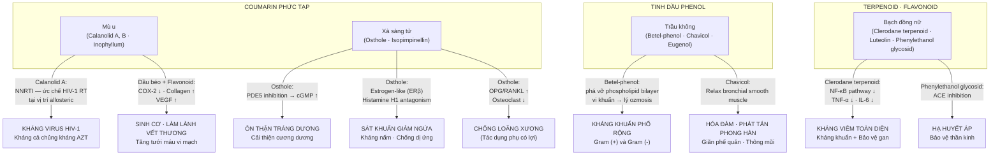
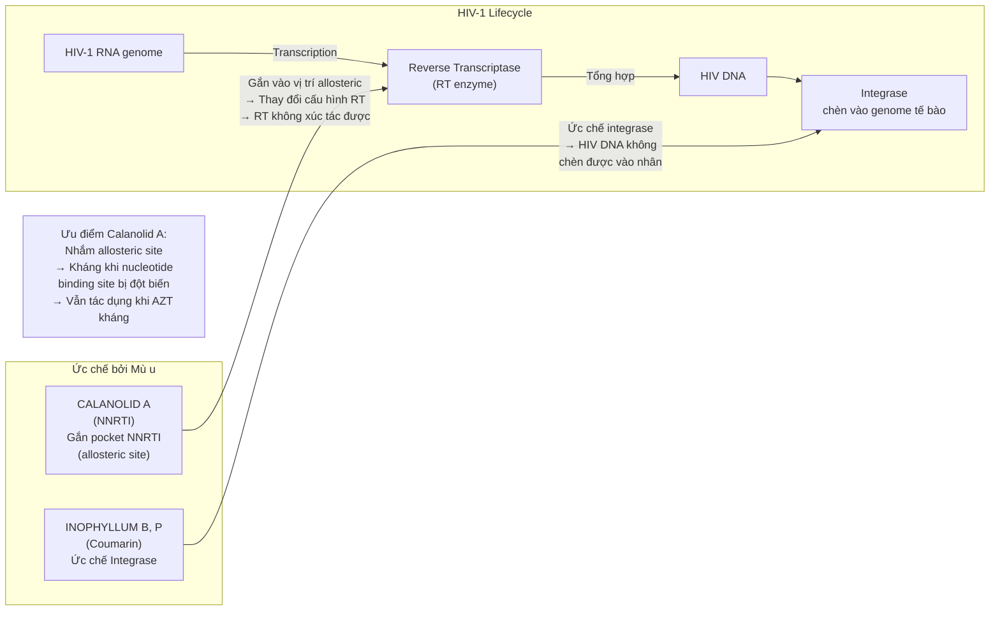
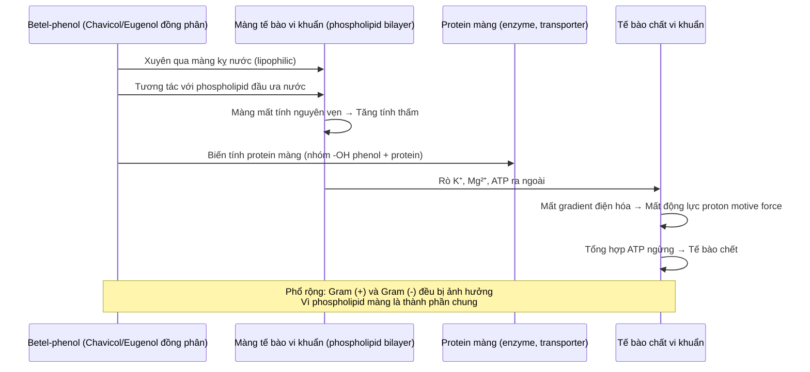
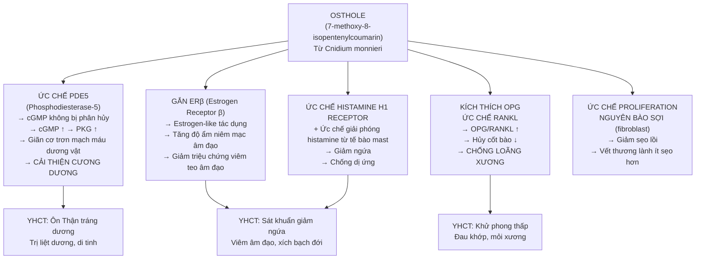
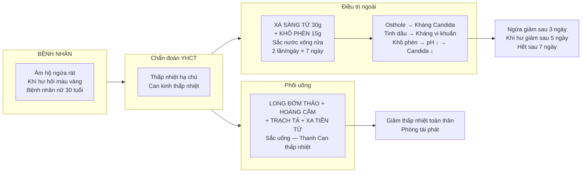

import MedicalNote from '~/components/MedicalNote.astro';
import ClinicalPearl from '~/components/ClinicalPearl.astro';

## Bản đồ cơ chế tổng quan — Bài 18

---

## Cơ chế chi tiết — Calanolid A (Mù u) kháng HIV

<MedicalNote>

**Calanolid A vs Efavirenz (NNRTI tổng hợp thông dụng):**

Cả hai đều là NNRTI nhưng cấu trúc hóa học khác nhau → vị trí gắn trong pocket NNRTI khác nhau. Điều này có ý nghĩa: khi HIV đột biến kháng Efavirenz (K103N), Calanolid A vẫn có thể còn tác dụng. Đây là lý do tại sao nghiên cứu Calanolid A vẫn tiếp tục dù đã có NNRTI tổng hợp — nhằm mở rộng kho vũ khí trị liệu HIV kháng thuốc.

Trong YHCT: Mù u "tính đại hàn" — chỉ số hàn cao nhất trong bài — phản ánh tác dụng mạnh lên "nhiệt độc" (virus, vi khuẩn). Dùng ngoài để tránh tác dụng phụ toàn thân khi dùng uống.

</MedicalNote>

---

## Cơ chế chi tiết — Betel-phenol (Trầu không) kháng khuẩn

**Tại sao betel-phenol không được dùng điều trị nhiễm khuẩn toàn thân?**

- **Dược động học:** Tinh dầu phenol bay hơi → hấp thu kém qua đường uống, phân bố không ổn định.
- **Tính chọn lọc:** Cơ chế phá màng không phân biệt tế bào vi khuẩn và tế bào người → độc tế bào nếu nồng độ hệ thống cao.
- **Kết luận:** Tác dụng tốt nhất ở nồng độ cao tại chỗ (ngoài da, niêm mạc) → đây là lý do thuốc dùng ngoài.

---

## Cơ chế chi tiết — Osthole (Xà sàng tử) đa đích

<ClinicalPearl>

**Xà sàng tử ôn Thận + Trầu không mát (cay ôn nhưng nhẹ hơn) + Xà sàng tử sát khuẩn — tại sao Xà sàng tử quy kinh Thận?**

Osthole tác động trực tiếp lên trục Thận-sinh dục (testosterone, cương dương, loãng xương — đều thuộc phạm vi Thận YHCT). Xà sàng tử "vị cay, ôn" phản ánh tác động ấm → kích hoạt Thận dương. Trong khi đó Trầu không "cay ôn" nhưng quy kinh Tỳ Phế — ôn trung hành khí, không ảnh hưởng Thận. Quy kinh phản ánh đích tác dụng ưu tiên, không chỉ là tính nhiệt.

</ClinicalPearl>

---

## Worked example — Viêm âm đạo do nấm Candida + vi khuẩn hỗn hợp

**Cơ chế phối hợp Xà sàng tử + Khô phèn:**
- **Xà sàng tử (pH trung tính):** Osthole phá màng Candida, tinh dầu kháng vi khuẩn.
- **Khô phèn (KAl(SO₄)₂):** pH ↓ (acid) → môi trường bất lợi cho Candida (vốn phát triển tốt ở pH 5.5–6.5, bị ức chế ở pH < 4.5). Ngoài ra khô phèn làm se niêm mạc → giảm tiết dịch → giảm môi trường cho vi khuẩn kỵ khí.
- **Tác dụng kép:** Xà sàng tử diệt mầm bệnh + Khô phèn thay đổi môi trường → kháng nấm/khuẩn mạnh hơn từng vị đơn lẻ.

---

## Bảng cơ chế so sánh — góc nhìn dược lý phân tử

<table>
<thead>
<tr><th>Vị thuốc</th><th>Hoạt chất</th><th>Đích phân tử</th><th>Cơ chế</th><th>Công năng YHCT</th></tr>
</thead>
<tbody>
<tr><td>Mù u</td><td>Calanolid A</td><td>HIV-1 Reverse Transcriptase (allosteric)</td><td>NNRTI → ức chế tổng hợp HIV DNA</td><td>Sát trùng (nhiệt độc)</td></tr>
<tr><td>Mù u</td><td>Dầu béo + Flavonoid</td><td>COX-2, VEGF, Collagen synthesis</td><td>Kháng viêm + Tăng sinh cơ</td><td>Sinh cơ, chỉ thống</td></tr>
<tr><td>Trầu không</td><td>Betel-phenol (chavicol)</td><td>Phospholipid màng vi khuẩn</td><td>Phá vỡ màng → mất ATP → chết khuẩn</td><td>Tiêu độc, sát trùng</td></tr>
<tr><td>Xà sàng tử</td><td>Osthole</td><td>PDE5 enzyme</td><td>cGMP ↑ → giãn cơ trơn → cương dương</td><td>Ôn Thận tráng dương</td></tr>
<tr><td>Xà sàng tử</td><td>Osthole</td><td>Estrogen receptor β + H1 receptor</td><td>Estrogen-like + kháng histamine → giảm ngứa</td><td>Sát khuẩn giảm ngứa</td></tr>
<tr><td>Bạch đồng nữ</td><td>Clerodane terpenoid</td><td>NF-κB pathway</td><td>NF-κB ↓ → TNF-α, IL-6 ↓ → kháng viêm</td><td>Thanh nhiệt giải độc, tiêu viêm</td></tr>
<tr><td>Bạch đồng nữ</td><td>Phenylethanol glycosid</td><td>ACE enzyme</td><td>ACE inhibition → Angiotensin II ↓ → Hạ áp</td><td>Khu phong trừ thấp (bảo vệ mạch máu)</td></tr>
</tbody>
</table>

---

## Câu hỏi cơ chế nâng cao

1. **Osthole ức chế PDE5 (như sildenafil) — tại sao Xà sàng tử không được dùng để thay thế sildenafil trong rối loạn cương dương?** Hãy phân tích sự khác biệt về dược động học, mức độ ức chế PDE5, và nguy cơ khi phối hợp với nitrate.

2. **Calanolid A là NNRTI nhắm allosteric site khác Efavirenz — điều này có nghĩa là kháng chéo (cross-resistance) sẽ thấp hơn hay cao hơn?** Giải thích cơ chế đột biến K103N của HIV-RT và tại sao vị trí gắn thuốc quan trọng hơn loại thuốc.

3. **Betel-phenol phá màng tế bào vi khuẩn — nhưng tế bào người cũng có màng phospholipid.** Tại sao ở nồng độ điều trị (dùng ngoài da) nó không gây độc tế bào da, nhưng nhai lá Trầu không lâu ngày lại tăng nguy cơ ung thư miệng?
