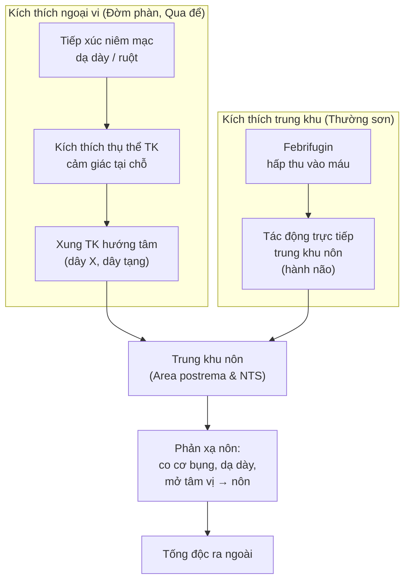
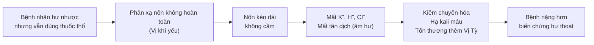

import KeyPoints from '~/components/KeyPoints.astro';
import CompareTable from '~/components/CompareTable.astro';
import ClinicalPearl from '~/components/ClinicalPearl.astro';
import SourceNote from '~/components/SourceNote.astro';

## Câu hỏi trung tâm

**Vì sao thuốc thổ chỉ hoạt động khi "tà còn ở thượng tiêu và bệnh nhân thực" — và điều này liên hệ thế nào với dược lý hiện đại?**

<KeyPoints title="Luận điểm cốt lõi">

- Thuốc thổ tác động qua **phản xạ thần kinh** (hoặc kích thích trực tiếp trung khu nôn) — chỉ hiệu quả khi độc chưa hấp thu.
- Ba vị có **3 con đường thần kinh** khác nhau → không thể dùng thay thế bừa bãi.
- Độc tính của thuốc thổ là vấn đề **tích lũy và ngưỡng** — cơ thể hư nhược không chịu được ngưỡng đó.
- "Dưỡng Vị khí sau nôn" trong YHCT tương ứng với bảo vệ niêm mạc và hệ vi sinh đường ruột sau stress cơ học.

</KeyPoints>

---

## 1. Bản đồ cơ chế tổng thể



---

## 2. Cơ chế từng vị — phân tích chi tiết

### 2.1. Đờm phàn (CuSO₄)

**Con đường:** Ngoại vi → trung khu

Ion Cu²⁺ tiếp xúc niêm mạc dạ dày:
1. Kích thích thụ thể hóa học và cơ học trong thành dạ dày.
2. Xung thần kinh theo dây phế vị (dây X) lên hành não.
3. Kích hoạt trung khu nôn (area postrema) → phản xạ nôn.

**Vì sao có độc tính:**
- Cu²⁺ liên kết protein enzyme → ức chế chuỗi hô hấp tế bào.
- Tích lũy ở gan (Cu gan > 100 μg/g wet weight → bệnh Wilson-like).
- Ngưỡng độc thấp ở người hư nhược (chức năng gan kém, protein huyết tương giảm).

**Tác dụng kháng khuẩn (dùng ngoài):** Cu²⁺ phá vỡ màng tế bào vi khuẩn và biến tính protein vách tế bào → ức chế *P. aeruginosa*, *Salmonella*, *Shigella*.

---

### 2.2. Qua để (cucurbitacin)

**Con đường:** Ngoại vi (cảm giác + cơ học ruột) → trung khu

```
Cucurbitacin uống
    ↓ tiếp xúc niêm mạc
    ↓ kích thích TK cảm giác (thụ thể TRPA1, TRPV1)
    ↓ xung TK → hành não
    ↓ ĐỒNG THỜI kích thích ruột co bóp
    → Nôn + nhuận tràng song song
```

**Đặc điểm "hít mũi" để trừ hoàng đàn:**
- Cucurbitacin dạng bột hít qua mũi kích thích niêm mạc mũi → phản xạ hắt hơi và chảy nước mũi → YHCT gọi là "khứ thấp tà qua khiếu mũi".
- Không có bằng chứng dược lý hiện đại rõ ràng về cơ chế làm giảm bilirubin qua đường này; có thể do kích thích phản xạ thần kinh tự chủ.

---

### 2.3. Thường sơn (febrifugin)

**Con đường:** Hấp thu vào máu → trung khu nôn + đích sốt rét

| Cơ chế | Chi tiết |
|---|---|
| Gây nôn | Febrifugin hấp thu nhanh, qua BBB kém nhưng đủ kích thích area postrema |
| Diệt sốt rét | Ức chế prolyl-tRNA synthetase của *Plasmodium* (febrifugin = halofuginone tiền chất) — IC₅₀ thấp hơn quinine ~100 lần |
| Hạ huyết áp | Cơ chế giãn mạch ngoại vi, chưa rõ hoàn toàn |

<ClinicalPearl>

**Tại sao Thường sơn có tác dụng triệt ngược mạnh nhưng ít dùng đơn độc?** Gây nôn mạnh (tác dụng phụ chính) làm bệnh nhân không uống được đủ liều. Phối Hậu phác + Thảo quả + Bình lang vừa ôn Tỳ Vị giảm nôn, vừa hóa thấp (cơ chế thấp nhiệt trong sốt rét theo YHCT).

</ClinicalPearl>

---

## 3. Tại sao "hư nhược thì cấm dùng" — cơ chế YHCT và YHHĐ

### Góc YHCT

"Chính khí" trong YHCT bao gồm: Vị khí, Tỳ khí, tinh khí. Khi hư nhược:
- Vị khí yếu → co bóp thành dạ dày yếu → nôn ra không thoát được hoặc nôn không cầm.
- Tỳ khí hư → sau nôn không dưỡng lại được → Tỳ Vị thêm hư.
- Tinh khí suy → không chịu được stress nôn → nguy cơ vong âm (mất tân dịch nặng).

### Góc YHHĐ

| Yếu tố hư nhược | Nguy cơ khi dùng thuốc thổ |
|---|---|
| Giảm protein huyết tương | Đờm phàn (Cu²⁺) tự do tăng → độc hơn |
| Rối loạn điện giải sẵn có | Nôn làm mất thêm K⁺, H⁺ → hạ Kali, kiềm chuyển hóa |
| Chức năng gan suy | Không thải được độc, không chuyển hóa alkaloid |
| Yếu cơ hoành, cơ bụng | Không tạo đủ áp lực trong ổ bụng để nôn hiệu quả |
| Rối loạn thần kinh | Phản xạ bảo vệ đường thở kém → hít sặc khi nôn |

---

## 4. Cầu nối sách vở → lâm sàng

```
Bệnh nhân ăn thức ăn nghi ngộ độc 2 giờ trước
    ↓
BƯỚC 1: Đánh giá "còn ở thượng tiêu không?"
         → Dạ dày còn chứa thức ăn? (chưa 4 giờ → có thể còn)
    ↓
BƯỚC 2: Đánh giá "bệnh nhân còn thực không?"
         → Mạch có lực, tứ chi ấm, không hư nhược
    ↓
BƯỚC 3: Không có CĐ? (không già, không mang thai, không xuất huyết...)
    ↓
BƯỚC 4: Chọn vị thuốc thổ phù hợp → liều thấp trước
    ↓
BƯỚC 5: Theo dõi → dừng đúng lúc → dưỡng Vị sau nôn
```

**Worked example:**

Bệnh nhân 35 tuổi, nam, ăn hải sản 2 giờ trước, đau bụng buồn nôn, chưa nôn, mạch có lực, không có bệnh nền. Theo YHCT: **dùng Đờm phàn tán nhỏ liều 0,3 g** (liều thấp nhất), uống với nước ấm, theo dõi sát 30 phút. Nếu chưa nôn → tăng lên 0,6 g. Nếu nôn được → dừng, nghỉ ngơi.

---

## 5. Sơ đồ chuỗi nhân quả — "dùng sai thì sao"



<SourceNote>

- Nguồn: `Raw/Thuoc_YHCT/chuong-02-cac-nhom-thuoc/bai-19-thuoc-gay-non_001.md`
- Sách: *Thuốc Y học cổ truyền (Tập 1)* — TS. Hứa Hoàng Oanh, TS. Nguyễn Thành Triết

</SourceNote>
